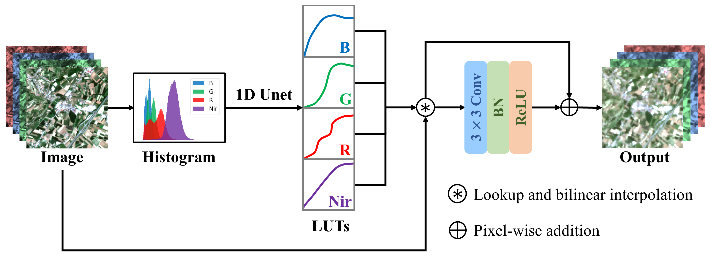

# UNet-Induced Tile-Adaptive Lookup Tables

Implementation for: [Bandpass Alignment from Sentinel-2 to Gaofen-1 ARD Products with UNet-Induced Tile-Adaptive Lookup Tables](https://www.mdpi.com/2072-4292/15/10/2563)




## Abstract

The successful launching of more satellites in recent years has made data fusion an important and promising task because it can significantly increase the temporal frequency of the resulting time series data. To improve the usability of Gaofen-1 analysis ready data (GF1-ARD), Sentinel-2 (S2) is selected to enhance the temporal resolution of GF1-ARD due to their similar characteristics and short revisit period. Before constructing a denser time series from different platforms, bandpass alignment is required. Most researchers implement bandpass alignment using the linear model. However, the transformed bands of S2 by the linear model cannot match GF1-ARD well due to the limited globally shared parameters. In contrast, local-derived lookup tables (LUTs) can better address this problem. Inspired by the powerful capability of deep learning, we develop a model based on the U-shaped network (UNet) to learn tile-adaptive LUTs. Specifically, the LUTs are adaptively learned from the histogram of the S2 tile. Given that the bandpass alignment can be viewed as a histogram matching process, the expected LUTs are believed to be highly correlated with the input histogram. In addition, a simple convolutional module is further introduced to address the pixel-level misregistration. We have created a large-scale dataset and conducted extensive experiments on it to evaluate the competitive performance of the proposed model. Meanwhile, extensive visualizations are generated to illustrate the mechanism of our model. Furthermore, the temporal frequency of S2 and GF1-ARD is thoroughly assessed to demonstrate that bandpass alignment can significantly improve the temporal resolution of GF1-ARD.

## Software

package installation

```sh
pip install -r ./requirements.txt
```


## Train & Evaluate

`train models`

```sh
python main.py train --train=True --useTVLoss=True --tag=Unet1DConv-TVLoss
```

`test models`

```sh
python main.py test --testModel=epochs_195.pth --useTVLoss=True --tag=Unet1DConv-TVLoss
```


## Dataset

We provide the toy version of our dataset instead of the complete version because it is too big, with three patches randomly selected for each tile. The toy dataset  can be downloaded from Google Drive or Baidu Drive:

- Link: [Baidu drive](https://pan.baidu.com/s/1Y8T1AUlWXPbnwchvVASubw) (extraction code: bpal)
- Link: [Google drive](https://drive.google.com/drive/folders/1JOmrlXD16JBP43UQdzJtXz_uCfFxFTUP?usp=share_link)

The details about these datasets can be found in our [article](https://www.mdpi.com/2072-4292/15/10/2563).

`./dataset`

```python
├─data # need to download
│  ├─Brazil
│  │  ├─GF1
│  │  ├─mask
│  │  └─S2
│  ├─France
│  │  ├─GF1
│  │  ├─mask
│  │  └─S2
│  ├─Loess
│  │  ├─GF1
│  │  ├─mask
│  │  └─S2
│  ├─Patch512Historam256-S2.pickle
│  └─tileHistoram256-S2.pickle
├─divide
│  ├─test.txt
│  ├─train.txt
│  └─val.txt
├─__init__.py
└─datasetCNNHist.py
```


## Citation

If this code helps in your work, please consider citing us.

```
Liu, Z.-Q.; Wang, Z.; Zhao, Z.; Huo, L.; Tang, P.; Zhang, Z. Bandpass Alignment from Sentinel-2 to Gaofen-1 ARD Products with UNet-Induced Tile-Adaptive Lookup Tables. Remote Sens. 2023, 15, 2563. https://doi.org/10.3390/rs15102563
```

or

```
@Article{rs15102563,
AUTHOR = {Liu, Zhi-Qiang and Wang, Zhao and Zhao, Zhitao and Huo, Lianzhi and Tang, Ping and Zhang, Zheng},
TITLE = {Bandpass Alignment from Sentinel-2 to Gaofen-1 ARD Products with UNet-Induced Tile-Adaptive Lookup Tables},
JOURNAL = {Remote Sensing},
VOLUME = {15},
YEAR = {2023},
NUMBER = {10},
ARTICLE-NUMBER = {2563},
URL = {https://www.mdpi.com/2072-4292/15/10/2563},
ISSN = {2072-4292},
DOI = {10.3390/rs15102563}
}
```


## License

The code and the models are MIT licensed, as found in the LICENSE file.